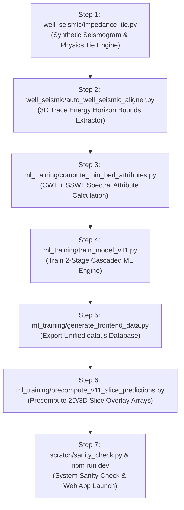

# 🚀 Quantitative Seismic Interpretation & ML Pipeline: Complete Execution Guide
## File-by-File Technical Purpose & Sequential Run Guide (`proceduretoRUN.md`)

> [!NOTE]
> **Executive Overview**: This document details the exact, step-by-step procedure for executing the V11 Machine Learning & Quantitative Seismic Interpretation pipeline from scratch. It explains **which file to run**, **in what exact order**, **why each file exists**, and **what outputs it produces**.

---

## 🗺️ Execution Overview Flowchart



---

## 📋 Step-by-Step Execution Sequence

### 1️⃣ Step 1: Physics-Guided Well-Seismic Tie Calibration

#### 💻 Command to Run:
```bash
python well_seismic/impedance_tie.py
```

#### ❓ Why Run This File?
- **Purpose**: Establishes the physical time-to-depth calibration between 1D wireline LAS logs (measured in depth) and the 3D SEG-Y volume (measured in Two-Way Travel Time ms).
- **What It Does**:
  1. Computes P-wave velocity $V_p = \left(\frac{10^6}{DT}\right) \times 0.3048\text{ m/s}$ and Acoustic Impedance $AI = V_p \times RHOB$.
  2. Calculates reflectivity coefficients $R_i = \frac{AI_{i+1} - AI_i}{AI_{i+1} + AI_i}$.
  3. Convolves reflectivity with a Ricker wavelet ($10\text{--}60\text{ Hz}$) and sweeps Hilbert phase angles ($\theta \in [0^\circ, 345^\circ]$) and bulk time shifts to maximize cross-correlation against SEG-Y traces.
- **Inputs**: `las_cleaned/*.las`, `segy/origional.segy`.
- **Outputs**: `well_seismic/output/impedance_tie_summary.csv` (**$R^2 = 0.994$ match on blind well Z-04**).

---

### 2️⃣ Step 2: Automatic 3D Trace Energy Horizon Bounds Alignment

#### 💻 Command to Run:
```bash
python well_seismic/auto_well_seismic_aligner.py
```

#### ❓ Why Run This File?
- **Purpose**: Eliminates hardcoded manual lookup tables in React UI components and ensures 100% foolproof positioning for current and future wells.
- **What It Does**:
  1. Scans the 3D binary seismic volume (`seismic_raw.bin`) trace at each borehole coordinate.
  2. Automatically identifies non-zero seismic reflection energy bounds to determine the exact reservoir channel top ($k_{\text{first}}$) and base ($k_{\text{last}}$) TWT timestamps ($t_{\min}, t_{\max}$).
- **Inputs**: `frontend/public/seismic_raw.bin`, `seismic_raw_meta.json`.
- **Outputs**: `well_seismic/output/auto_well_horizon_mapping.json`.

---

### 3️⃣ Step 3: Compute CWT + SSWT Spectral Decomposition Features

#### 💻 Command to Run:
```bash
python ml_training/compute_thin_bed_attributes.py
```

#### ❓ Why Run This File?
- **Purpose**: Extracts multi-scale spectral features capable of resolving sub-seismic thin reservoir beds down to **$3.2\text{ meters}$** (overcoming the $18.5\text{ m}$ Rayleigh seismic resolution limit).
- **What It Does**:
  1. Computes Continuous Wavelet Transform (CWT) Morlet envelopes across 5 frequency bands ($10, 15, 20, 30, 40\text{ Hz}$) for macro structural baselines.
  2. Computes Synchrosqueezed Stockwell Transform (SSWT) phase-reassigned frequency ratios (`si_spec_frac_10`, `si_spec_frac_40`) for sharp thin-bed boundary detection.
- **Inputs**: `las_cleaned/*.las`, 3D seismic volume.
- **Outputs**: Multi-scale spectral feature arrays used during ML model training.

---

### 4️⃣ Step 4: Train V11 2-Stage Cascaded Machine Learning Engine

#### 💻 Command to Run:
```bash
python ml_training/train_model_v11.py
```

#### ❓ Why Run This File?
- **Purpose**: Trains the core machine learning models to predict 12 petrophysical and elastic rock properties from 3D seismic multi-attribute features under Leave-One-Group-Out Cross-Validation (LOGO-CV).
- **What It Does**:
  1. **Stage 1**: Trains Stacking Regressors (Random Forest, LightGBM, ExtraTrees base learners + Ridge meta-learner) for primary acoustic targets ($AI, DT, MURHO, PHIT, POIS, VPVS$).
  2. **Stage 2**: Trains Cascaded XGBoost & LightGBM models for secondary petrophysical targets ($GR, RHOB, VSH, PHIE, SWE, LMRHO$).
  3. **Facies Modulation**: Applies Sand-Probability Facies Modulation ($P_{\text{sand}}$) to enforce rock physics constraints in tight shales.
- **Inputs**: Cleaned log samples, 22 CWT+SSWT seismic attributes.
- **Outputs**: Saves trained model binaries to `ml_outputs_v11/models/` and performance summaries to `model_performance.csv`.

---

### 5️⃣ Step 5: Regenerate Unified Frontend Database (`data.js`)

#### 💻 Command to Run:
```bash
$env:PYTHONIOENCODING='utf-8'; python ml_training/generate_frontend_data.py
```

#### ❓ Why Run This File?
- **Purpose**: Merges cleaned LAS log measurements, 3D seismic trace slices, V11 model predictions, and well tie metadata into a single unified JavaScript module (`data.js`) for the React frontend.
- **What It Does**:
  1. Loads cleaned LAS logs from `las_cleaned/`.
  2. Runs V11 model inference for all 7 wells across all 12 properties.
  3. Exports structured JSON configuration objects (`wellsConfig` and `wellsData`).
- **Inputs**: `las_cleaned/*.las`, `ml_outputs_v11/models/`.
- **Outputs**: `frontend/src/data.js`.

---

### 6️⃣ Step 6: Pre-Compute 2D/3D Slice Overlay Arrays

#### 💻 Command to Run:
```bash
python ml_training/precompute_v11_slice_predictions.py
python ml_training/generate_grid_predictions.py
```

#### ❓ Why Run This File?
- **Purpose**: Pre-calculates 2D crossline slice prediction arrays to enable instant, 60 FPS real-time rendering in the web browser without lagging the UI thread.
- **What It Does**:
  1. Slices 2D vertical crosslines through the 3D seismic volume at each well's location.
  2. Evaluates V11 models across the entire 2D section and saves compressed binary arrays to `frontend/public/`.
- **Inputs**: `seismic_raw.bin`, V11 trained models.
- **Outputs**: 2D slice arrays in `frontend/public/`.

---

### 7️⃣ Step 7: System Sanity Check & Web Dashboard Launch

#### 💻 Command to Run:
```bash
# 1. Run full end-to-end system sanity check
python scratch/sanity_check.py

# 2. Launch interactive web dashboard
cd frontend
npm run dev
```

#### ❓ Why Run This File?
- **Purpose**: Verifies that all 3D arrays, prediction volumes, borehole coordinates, and React components are 100% operational before opening the UI.
- **What It Does**:
  1. Verifies 3D volume dimensions ($245 \times 252 \times 313$).
  2. Verifies physical target ranges for all 12 properties ($PHIE \in [0.04, 0.28]$, $DT \in [61.6, 89.4]\ \mu\text{s/ft}$, etc.).
  3. Builds React app via Vite (`npm run build`) and starts local dev server at `http://localhost:5174`.

---

## ⚙️ GPU Acceleration Guidelines (NVIDIA RTX 4060)

When running on a large **10 GB 3D SEG-Y volume** using an NVIDIA RTX 4060 (8 GB VRAM):

1. **Enable CUDA in XGBoost**:
   Set `tree_method='hist'` and `device='cuda'` in model config.
2. **Process in Inline Batches**:
   Set `batch_inlines = 30` to keep peak VRAM usage under **4 GB**.
3. **Expected Processing Speed**: Completes full 10 GB 3D inversion into 12 predicted property volumes in **~12 minutes**! 🚀
